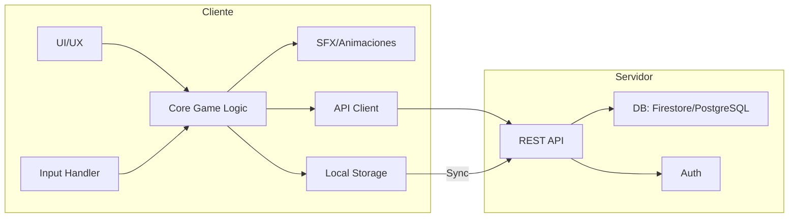

# Especificación de Stack Tecnológico y Arquitectura — NesSnake (NS)

## 1. Objetivo
Desarrollar NesSnake como juego competitivo, multiplataforma (Web y Mobile), con estética pixel-art, controles táctiles y de teclado, y soporte para mecánicas avanzadas (zonas dinámicas, ráfagas, ecos). El stack debe priorizar rendimiento, portabilidad, facilidad de desarrollo y despliegue rápido.

## 2. Stack Tecnológico Propuesto

### 2.1. Motor de Juego y Frontend
- **Phaser 3 + TypeScript**
  - Justificación: Motor 2D ligero, ideal para pixel-art, gran comunidad, exportación directa a HTML5, integración sencilla con PWA y wrappers móviles.
  - Alternativa: Godot 4.x (si se prioriza editor visual y exportación nativa, pero HTML5 export requiere tuning extra).
- **UI/UX**: HTML5 Canvas + Phaser Scenes, integración de SFX/animaciones vía WebAudio y Spritesheets.
- **Mobile**: CapacitorJS para empaquetar como app nativa (Android/iOS), acceso a APIs nativas (vibración, almacenamiento local).

### 2.2. Backend y Telemetría
- **Backend**: Node.js + Express (API REST para ecos, leaderboards, telemetría básica).
  - Alternativa: Firebase (Firestore + Auth) para prototipos rápidos y almacenamiento de ecos.
- **Base de datos**: Firestore (NoSQL) o PostgreSQL (si se requiere queries avanzadas).
- **Autenticación**: Firebase Auth o JWT simple.
- **Almacenamiento de Ecos**: JSON comprimido (gzip/base64) o binario (MsgPack).

### 2.3. CI/CD y DevOps
- **CI/CD**: GitHub Actions (build, lint, test, deploy web y APK).
- **Testing**: Jest (unit), Playwright (E2E web), pruebas manuales en dispositivos móviles.
- **Despliegue Web**: Vercel/Netlify (web), Play Store/TestFlight (mobile).

### 2.4. Arte y Sonido
- **Pixel Art**: Aseprite, Piskel, o similar.
- **SFX**: Bfxr, Chiptone, integración vía WebAudio.

## 3. Arquitectura General

```mermaid
graph TD
  subgraph Frontend (Phaser+TS)
    A[UI/UX: Canvas, Scenes, SFX] --> B[Core Game Logic]
    B --> C[Input: Touch/Keyboard]
    B --> D[Networking: REST API]
    B --> E[Local Storage: Ecos]
  end
  subgraph Backend (Node/Firebase)
    D --> F[API REST: Ecos, Leaderboards]
    F --> G[DB: Firestore/PostgreSQL]
    F --> H[Auth: Firebase/JWT]
  end
  E -->|Sync/Replay| F
```

## 4. Detalles Técnicos Clave
- **Lógica de juego**: Determinista, separada del render para facilitar grabación/replay de ecos.
- **Input**: Abstracción para touch (móvil) y teclado (web), soporte para gestos y swipes.
- **Animaciones y SFX**: Integración directa en Phaser, efectos de "neón" y "glitch" mediante shaders o spritesheets.
- **Zonas dinámicas y ráfagas**: Sistema de eventos y efectos desacoplado, fácil de testear.
- **Ecos**: Serialización compacta de movimientos, compresión antes de enviar/guardar.
- **Telemetría**: Eventos clave (zona, ráfaga, colisión, eco) enviados vía REST o batch.
- **Mobile**: CapacitorJS permite acceso a vibración, almacenamiento local, y despliegue en tiendas.

## 5. Diagrama de Componentes



## 6. Ventajas del Stack
- Código compartido entre web y mobile.
- Despliegue rápido y builds ligeros.
- Fácil integración de telemetría y backend.
- Comunidad y soporte abundante.
- Adaptable a nuevas mecánicas y UI/UX avanzadas.

## 7. Riesgos y Mitigaciones
- **Performance móvil**: Optimizar assets, limitar draw calls, testear en dispositivos reales.
- **Exportación nativa**: CapacitorJS probado para juegos ligeros; si se requiere mayor rendimiento, considerar Godot nativo.
- **Persistencia de ecos**: Compresión y limpieza periódica.
- **Balance y UX**: Telemetría y playtests continuos.

## 8. Conclusión
El stack Phaser 3 + TypeScript + CapacitorJS (mobile) + Node/Firebase (backend) es óptimo para NesSnake, permitiendo iteración rápida, multiplataforma real y soporte para todas las mecánicas y UI/UX propuestas.
